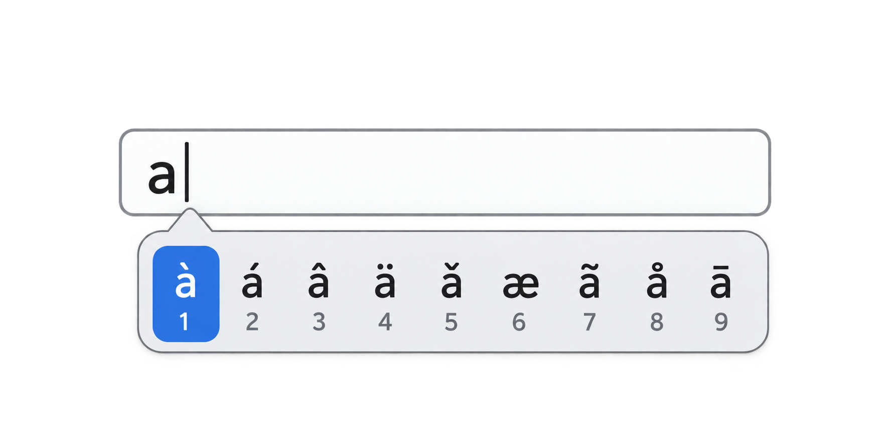

# GNOME Accent Hold

**macOS-style press-and-hold accent selection for GNOME/Linux, powered by IBus.**

GNOME Accent Hold adds a simple way to type accented and alternate Latin characters while keeping a US keyboard layout. Tap a key normally and it behaves exactly like a regular US keyboard. Hold a supported letter and a compact character menu appears next to the text cursor.



## Type accented characters by holding a key

In any supported application:

1. **Press and hold a letter key**, for example `a`.
2. If alternate characters are available, GNOME Accent Hold displays a popup next to the text cursor.
3. Choose a character by:
   - pressing the **number shown below it**, or
   - using the **Left/Right arrow keys** and pressing **Enter**.
4. Press **Esc** to dismiss the popup and keep the original character.

For example, holding `a` gives you:

`à  á  â  ä  ǎ  æ  ã  å  ā`

A normal quick press still types `a` immediately, so ordinary typing is not intentionally delayed.

The popup is only shown for letters that have alternate characters.

## Examples

| Hold | Available characters |
|---|---|
| `a` | `à á â ä ǎ æ ã å ā` |
| `e` | `è é ê ë ě ẽ ē ė ę` |
| `i` | `ì í î ï ǐ ĩ ī ı į` |
| `o` | `ò ó ô ö ǒ œ ø õ ō` |
| `u` | `ù ú û ü ǔ ũ ū ű ů` |
| `c` | `ç ć č ċ` |
| `n` | `ñ ń ņ ň` |

Uppercase variants are available with **Shift**.

## Why?

This project is inspired by the press-and-hold character picker available on macOS. It brings a similar interaction to GNOME without requiring you to switch away from a US keyboard layout or memorize dead-key combinations.

It is particularly useful if you normally type with a US keyboard but regularly write names or text in languages such as Italian, French, Spanish, German, Portuguese, or other languages using Latin diacritics.

## Features

- Immediate normal typing with a US keyboard layout
- Press-and-hold character picker
- Number shortcuts displayed below each candidate
- Arrow-key navigation
- Enter to select
- Escape to cancel
- Uppercase accented characters with Shift
- Ctrl, Alt and Super shortcuts pass through normally
- Popup anchored to the text cursor
- Multi-monitor/scaling-aware positioning on X11
- Lightweight IBus input method
- Automatic activation after GNOME login

## Requirements

The current release is developed and tested with:

- GNOME
- IBus
- Python 3
- PyGObject / GTK 3
- Pycairo
- X11

On Ubuntu/Debian, the required packages are typically available with:

```bash
sudo apt install ibus python3-gi gir1.2-gtk-3.0 python3-cairo
```

> **Wayland:** the current popup positioning implementation has been developed and tested on X11. Wayland support is a planned area of work.

## Install

Clone the repository and run the installer:

```bash
git clone <YOUR-GITHUB-REPOSITORY-URL>
cd gnome-accent-hold
chmod +x install.sh uninstall.sh
./install.sh
```

The installer places the user-level files under:

```text
~/.local/libexec/gnome-accent-hold/
~/.local/share/ibus/component/
~/.config/autostart/
```

Check the active IBus engine with:

```bash
ibus engine
```

When active, it should print:

```text
accent-hold
```

## Uninstall

From the repository directory:

```bash
./uninstall.sh
```

## Repository layout

```text
gnome-accent-hold/
├── src/
│   └── engine.py
├── data/
│   └── accent-hold.xml
├── assets/
│   └── accent-popup.png
├── install.sh
├── uninstall.sh
├── README.md
└── LICENSE
```

## Inspiration

The interaction is inspired by the familiar macOS press-and-hold accent menu. GNOME Accent Hold is an independent open-source implementation for GNOME/IBus and is not affiliated with or endorsed by Apple.

Apple documents the original interaction here: hold a letter to display its available diacritics, then choose a character from the menu using the displayed number or keyboard navigation.

## License

MIT License.
