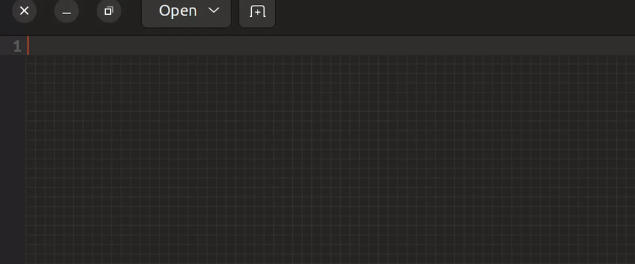

# GNOME Accent Hold

**macOS-style press-and-hold accent selection for GNOME/Linux, powered by IBus.**

GNOME Accent Hold adds a simple way to type accented and alternate Latin characters while keeping a US keyboard layout. Tap a key normally and it behaves exactly like a regular US keyboard. Hold a supported letter and a compact character menu appears next to the text cursor.

<p align="center">
  
</p>

<p align="center"><em>Hold a letter, then choose an accented character with a number or the arrow keys.</em></p>

## Type accented characters by holding a key

In any supported application:

1. **Press and hold a letter key**, for example `a`.
2. If alternate characters are available, GNOME Accent Hold displays a popup next to the text cursor.
3. Choose a character by:
   - pressing the **number shown below it**, or
   - using the **Left/Right arrow keys** and pressing **Enter**.
4. Press **Esc** to dismiss the popup and keep the original character.

For example, holding `a` gives you:

`à  á  â  ä  ǎ  æ  ã  å  ā`

A normal quick press still types `a` immediately, so ordinary typing is not intentionally delayed.

The popup is only shown for letters that have alternate characters.

## Examples

| Hold | Available characters |
|---|---|
| `a` | `à á â ä ǎ æ ã å ā` |
| `e` | `è é ê ë ě ẽ ē ė ę` |
| `i` | `ì í î ï ǐ ĩ ī ı į` |
| `o` | `ò ó ô ö ǒ œ ø õ ō` |
| `u` | `ù ú û ü ǔ ũ ū ű ů` |
| `c` | `ç ć č ċ` |
| `n` | `ñ ń ņ ň` |

Uppercase variants are available with **Shift**.

## Why?

This project is inspired by the press-and-hold character picker available on macOS. It brings a similar interaction to GNOME without requiring you to switch away from a US keyboard layout or memorize dead-key combinations.

It is particularly useful if you normally type with a US keyboard but regularly write names or text in languages such as Italian, French, Spanish, German, Portuguese, or other languages using Latin diacritics.

## Features

- Immediate normal typing with a US keyboard layout
- Press-and-hold character picker
- Number shortcuts displayed below each candidate
- Arrow-key navigation
- Enter to select
- Escape to cancel
- Uppercase accented characters with Shift
- Ctrl, Alt and Super shortcuts pass through normally
- Native IBus candidate panel anchored to the text cursor
- Wayland and X11 support without a focus-stealing or tileable application window
- Lightweight IBus input method
- Automatic activation after GNOME login

## Requirements

The current release is developed and tested with:

- GNOME
- IBus
- Python 3
- PyGObject with IBus introspection data
- A GNOME Wayland or X11 session

On Ubuntu/Debian, the required packages are typically available with:

```bash
sudo apt install ibus python3-gi gir1.2-ibus-1.0
```

The candidate UI is rendered by the IBus panel. On Wayland this keeps it out
of the compositor's normal application-window and tiling lifecycle; on X11 the
same IBus path is used for consistent behavior.

## Install

Clone the repository and run the installer:

```bash
git clone https://github.com/manux81/gnome-accent-hold
cd gnome-accent-hold
chmod +x install.sh uninstall.sh
./install.sh
```

The installer places both the engine and its IBus component in your user account:

```text
~/.local/libexec/gnome-accent-hold/engine.py
~/.local/share/ibus/component/accent-hold.xml
```

No `sudo` access is required, so installation works on immutable systems such as Fedora Silverblue. The installer refreshes the per-user IBus registry cache with both the user and system component paths. After installation, log out and back in (or restart IBus), then select **English (US) - Accent Hold** from GNOME's input sources.

If you previously installed a version that placed the component in `/usr/share/ibus/component`, the installer will report it and print the one-time command needed to remove that legacy file.

Check the active IBus engine with:

```bash
ibus engine
```

When active, it should print:

```text
accent-hold
```

## Application compatibility

GNOME Accent Hold uses the IBus input-method interface rather than application-specific key bindings. It has been designed to work across regular GTK applications and has also been tested with Chromium/Electron-style text fields and editors.

Normal keystrokes are forwarded to the application for native insertion and are only observed for hold detection, so surfaces that bypass IME commits (browser canvases, web-based server/serial consoles, remote-desktop views) still receive every character. Only the candidate-selection keys are consumed while the hold menu is visible.

Because Linux applications can implement input methods differently, please report application-specific issues with the application name, desktop session (X11/Wayland), and IBus version.

## Diagnostics

The engine records key flow, focus/reset events, lookup-table actions, candidate
clicks, and commits in `/tmp/accent-hold.log`. Set `ACCENT_HOLD_LOG` in the
engine environment to use a different path. Each key record includes its
keyval, hardware keycode, modifier mask, press/release state, popup state,
pending character, and selected candidate.

## Uninstall

From the repository directory:

```bash
./uninstall.sh
```

## Repository layout

```text
gnome-accent-hold/
├── src/
│   └── engine.py
├── data/
│   └── accent-hold.xml
├── assets/
│   ├── accent-hold-demo.gif
│   └── accent-popup.png
├── install.sh
├── uninstall.sh
├── README.md
└── LICENSE
```

## Inspiration

The interaction is inspired by the familiar macOS press-and-hold accent menu. GNOME Accent Hold is an independent open-source implementation for GNOME/IBus and is not affiliated with or endorsed by Apple.

Apple documents the original interaction here: hold a letter to display its available diacritics, then choose a character from the menu using the displayed number or keyboard navigation.

## License

MIT License.
